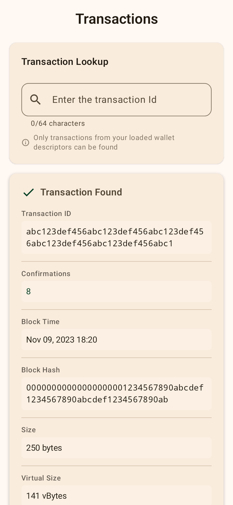
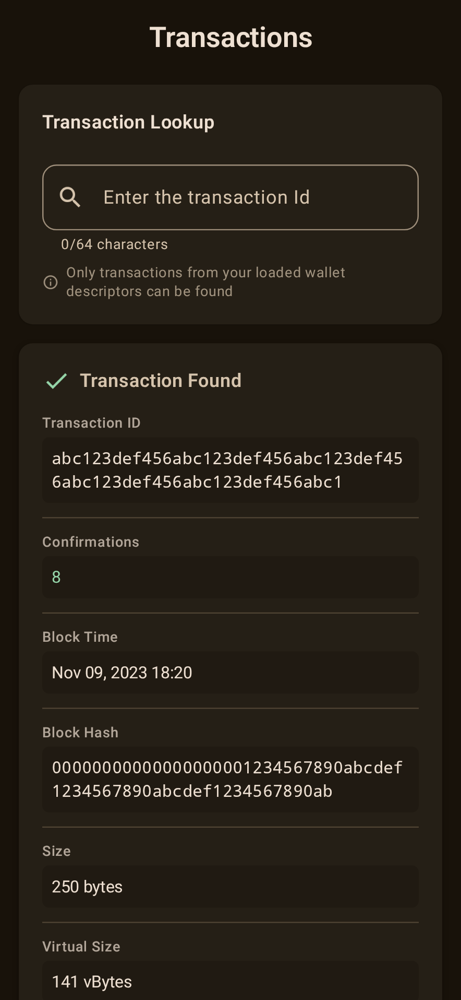
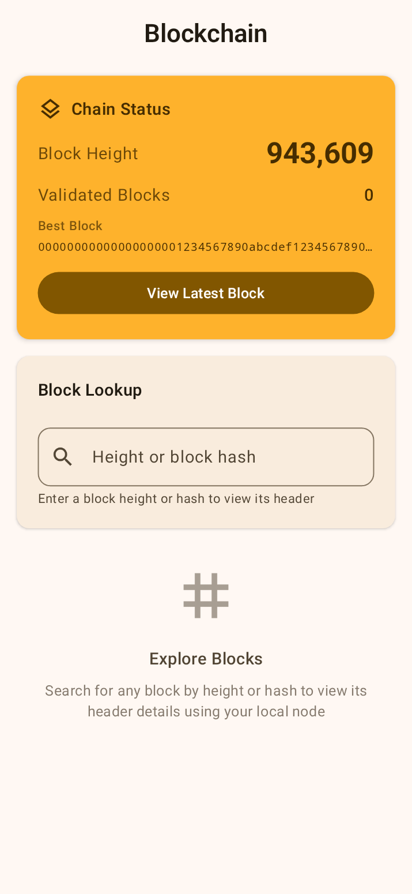
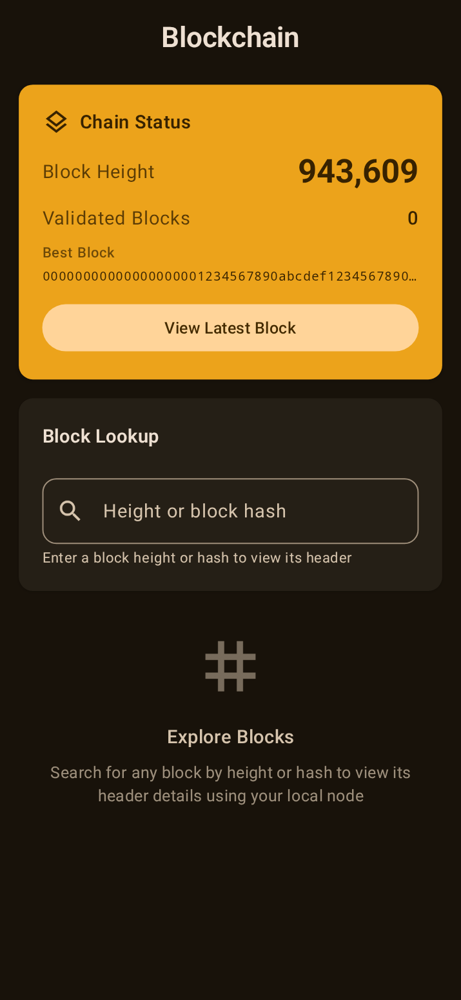

# Mandacaru 🌵

A lightweight Bitcoin validator node for Android, powered by [Utreexo](https://dci.mit.edu/utreexo) and [Floresta](https://github.com/vinteumorg/Floresta).

Run a full Bitcoin node directly on your phone with minimal storage requirements thanks to Utreexo's compact accumulator design.

## Features

- ⚡ **Lightweight**: Uses Utreexo to dramatically reduce storage requirements
- 🔒 **Self-sovereign**: Validate Bitcoin transactions directly on your device
- 🌐 **Multi-network**: Support for Bitcoin Mainnet, Testnet, Testnet4, Signet, and Regtest
- 🔍 **Transaction & Broadcast**: Search transactions and broadcast raw transactions
- 🧱 **Blockchain Explorer**: Search blocks by height or hash, view headers and chain status
- 👥 **P2P Networking**: Connect, disconnect, and ping Bitcoin peers
- 💼 **Wallet Integration**: Load descriptors and track your Bitcoin addresses
- 🔌 **Electrum Server**: Built-in Electrum server for wallet pairing
- 📊 **Real-time Sync**: Monitor blockchain synchronization progress
- 🩺 **Diagnostics**: Monitor node uptime and memory usage
- 🎨 **Modern UI**: Beautiful Material Design 3 interface with dark/light themes

## Screenshots

<div align="center">

### Node Information
<table>
  <tr>
    <td></td>
    <td></td>
  </tr>
  <tr>
    <td align="center"><em>Light Theme</em></td>
    <td align="center"><em>Dark Theme</em></td>
  </tr>
</table>

### Transactions
<table>
  <tr>
    <td></td>
    <td></td>
  </tr>
  <tr>
    <td align="center"><em>Light Theme</em></td>
    <td align="center"><em>Dark Theme</em></td>
  </tr>
</table>

### Blockchain
<table>
  <tr>
    <td></td>
    <td></td>
  </tr>
  <tr>
    <td align="center"><em>Light Theme</em></td>
    <td align="center"><em>Dark Theme</em></td>
  </tr>
</table>

### Settings & Configuration
<table>
  <tr>
    <td></td>
    <td></td>
  </tr>
  <tr>
    <td align="center"><em>Light Theme</em></td>
    <td align="center"><em>Dark Theme</em></td>
  </tr>
</table>

</div>

## What is Utreexo?

Utreexo is a dynamic hash-based accumulator that allows Bitcoin nodes to validate the blockchain without storing the full UTXO set. This reduces storage requirements from tens of gigabytes to just a few megabytes, making it practical to run a full validating node on mobile devices.

## Installation

### Requirements
- Android 10 (API 29) or higher
- ARM64 device (arm64-v8a architecture)
- Internet connection

### Releases
Download the latest APK from [GitHub Releases](https://github.com/jvsena42/mandacaru/releases).

### From Source
1. Clone the repository:
```bash
git clone https://github.com/jvsena42/mandacaru.git
cd mandacaru
```

2. Build the project:
```bash
./gradlew assembleDebug
```

3. Install on your device:
```bash
./gradlew installDebug
```

## Usage

### Getting Started
1. Launch the app and enable notifications when prompted
2. Add a wallet descriptor to track your addresses (in Settings > Descriptors)
3. Copy the Electrum server address (in Settings), then configure your wallet to use it as an Electrum server

### Node Info Screen
Monitor your node's status:
- **Sync Progress**: Current blockchain synchronization percentage
- **Network Info**: Connected network, peer count, and difficulty
- **Peers** (expandable): View connected peers, connect to new nodes, disconnect, or ping
- **Diagnostics** (expandable): Node uptime and memory usage

### Transaction Screen
Search and broadcast transactions:
- Enter a transaction ID (txid) to look up transaction details
- Broadcast a raw transaction to the network
- View complete transaction details and confirmations

### Blockchain Screen
Explore the blockchain:
- **Block Search**: Look up blocks by height or hash
- **Chain Status**: View block count, best block hash, and validated blocks
- **Block Headers**: View detailed block header information

### Settings Screen
Configure your node:
- **Electrum Address**: Copy the local Electrum server address to pair with your wallet
- **Descriptors**: Add or list wallet descriptors to track your addresses
- **Network**: Switch between Bitcoin networks (requires app restart)
- **Node**: Connect directly to specific Bitcoin nodes
- **About**: App version and project information
- **Donate**: Support the project via Lightning

## Architecture

Built with modern Android development practices:
- **Kotlin**: 100% Kotlin codebase
- **Jetpack Compose**: Declarative UI framework
- **Material Design 3**: Modern, adaptive design system
- **HorizontalPager + BottomNavigationBar**: Swipeable screen navigation
- **MVVM Architecture**: Clean separation of concerns
- **Coroutines & Flow**: Async operations and reactive streams
- **DataStore**: Persistent preferences
- **Koin**: Lightweight dependency injection
- **OkHttp**: Network communication
- **JSON-RPC**: Bitcoin Core compatible RPC interface

## Related Projects

- [Floresta Wallet](https://github.com/jvsena42/floresta_app) - A wallet client running Floresta
- [Floresta Core](https://github.com/vinteumorg/Floresta) - The underlying Floresta implementation

## Support the Project

If you find this project useful, consider supporting development:

**Lightning**: `jvsena42@blink.sv`

## License

This project is open source. Please check the repository for license details.

## Acknowledgments

- Built on top of [Floresta](https://github.com/vinteumorg/Floresta)
- Implements [Utreexo](https://dci.mit.edu/utreexo) accumulator design
- Inspired by the Bitcoin community's commitment to decentralization

---

Made with ⚡ for the Bitcoin network
