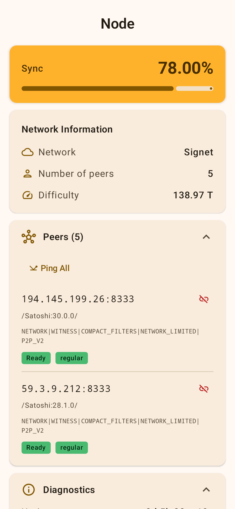
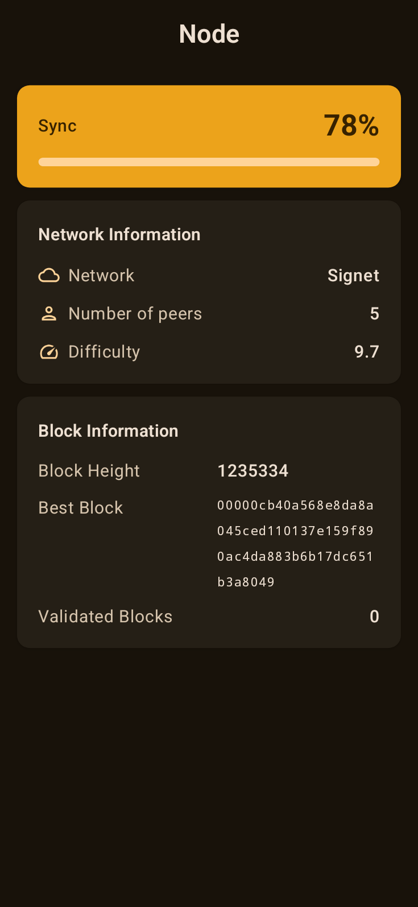
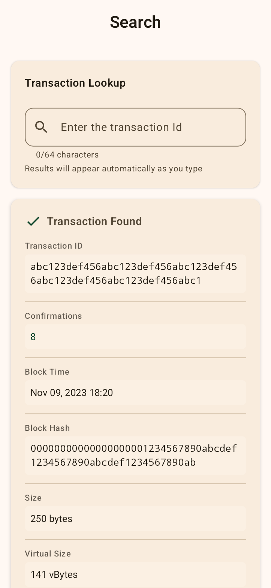
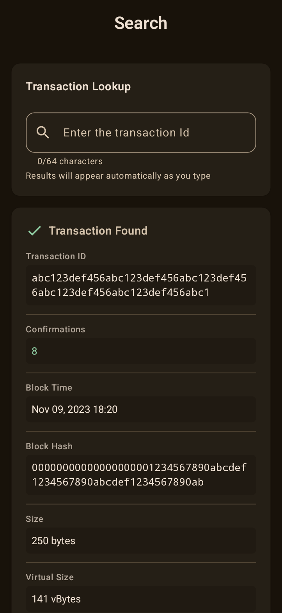
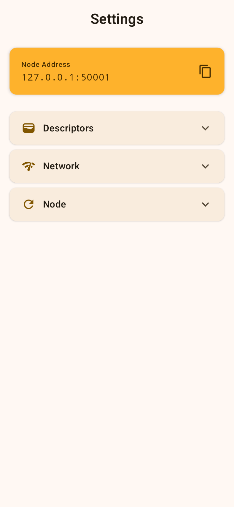
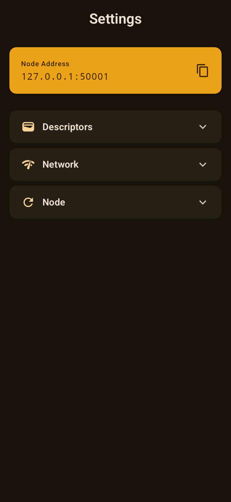

# Floresta Node 🌳

A lightweight Bitcoin validator node for Android, powered by [Utreexo](https://dci.mit.edu/utreexo) and [Floresta](https://github.com/vinteumorg/Floresta).

Run a full Bitcoin node directly on your phone with minimal storage requirements thanks to Utreexo's compact accumulator design.

## Features

- ⚡ **Lightweight**: Uses Utreexo to dramatically reduce storage requirements
- 🔒 **Self-sovereign**: Validate Bitcoin transactions directly on your device
- 🌐 **Multi-network**: Support for Bitcoin Mainnet, Testnet, Signet, and Regtest
- 🔍 **Transaction Lookup**: Search and verify transactions on the blockchain
- 👥 **P2P Networking**: Connect to Bitcoin peers and manage node connections
- 💼 **Wallet Integration**: Load descriptors and track your Bitcoin addresses
- 📊 **Real-time Sync**: Monitor blockchain synchronization progress
- 🎨 **Modern UI**: Beautiful Material Design 3 interface with dark/light themes

## Screenshots

<div align="center">

### Node Information
<table>
  <tr>
    <td></td>
    <td></td>
  </tr>
  <tr>
    <td align="center"><em>Light Theme</em></td>
    <td align="center"><em>Dark Theme</em></td>
  </tr>
</table>

### Transaction Search
<table>
  <tr>
    <td></td>
    <td></td>
  </tr>
  <tr>
    <td align="center"><em>Light Theme</em></td>
    <td align="center"><em>Dark Theme</em></td>
  </tr>
</table>

### Settings & Configuration
<table>
  <tr>
    <td></td>
    <td></td>
  </tr>
  <tr>
    <td align="center"><em>Light Theme</em></td>
    <td align="center"><em>Dark Theme</em></td>
  </tr>
</table>

</div>

## What is Utreexo?

Utreexo is a dynamic hash-based accumulator that allows Bitcoin nodes to validate the blockchain without storing the full UTXO set. This reduces storage requirements from tens of gigabytes to just a few megabytes, making it practical to run a full validating node on mobile devices.

## Installation

### Requirements
- Android 10 (API 29) or higher
- ARM64 device (arm64-v8a architecture)
- Internet connection

### From Source
1. Clone the repository:
```bash
git clone https://github.com/jvsena42/floresta_node.git
cd floresta_node
```

2. Build the project:
```bash
./gradlew assembleDebug
```

3. Install on your device:
```bash
./gradlew installDebug
```

## Usage

### Getting Started
1. Launch the app - the Floresta node will start automatically in the background
2. Select your preferred network (Bitcoin, Testnet, Signet, or Regtest) in Settings
3. Wait for initial sync to complete
4. Optionally add wallet descriptors to track your addresses

### Node Screen
Monitor your node's status:
- **Sync Progress**: Current blockchain synchronization percentage
- **Network Info**: Connected network, peer count, and difficulty
- **Block Info**: Latest block height, hash, and validated blocks

### Search Screen
Look up transactions:
- Enter a transaction ID (txid)
- View complete transaction details
- Verify transaction confirmations

### Settings Screen
Configure your node:
- **Descriptors**: Add wallet descriptors to track your addresses
- **Network**: Switch between Bitcoin networks (requires app restart)
- **Node**: Connect directly to specific Bitcoin nodes
- **Rescan**: Trigger a blockchain rescan for your wallet

## Architecture

Built with modern Android development practices:
- **Kotlin**: 100% Kotlin codebase
- **Jetpack Compose**: Declarative UI framework
- **Material Design 3**: Modern, adaptive design system
- **MVVM Architecture**: Clean separation of concerns
- **Coroutines & Flow**: Async operations and reactive streams
- **Koin**: Lightweight dependency injection
- **OkHttp**: Network communication
- **JSON-RPC**: Bitcoin Core compatible RPC interface

## RPC Methods

The node exposes a JSON-RPC interface on `localhost`:
- **getblockchaininfo**: Get blockchain synchronization status
- **getpeerinfo**: List connected peers
- **gettransaction**: Retrieve transaction details
- **loaddescriptor**: Add wallet descriptor
- **listdescriptors**: List loaded descriptors
- **addnode**: Connect to a specific node
- **rescan**: Rescan blockchain for wallet transactions
- **stop**: Gracefully stop the node

## Related Projects

- [Floresta Wallet](https://github.com/jvsena42/floresta_app) - A wallet client running Floresta
- [Floresta Core](https://github.com/Davidson-Souza/Floresta) - The underlying Floresta implementation

## Support the Project

If you find this project useful, consider supporting development:

**Lightning**: `jvsena42@blink.sv`

## License

This project is open source. Please check the repository for license details.

## Acknowledgments

- Built on top of [Floresta](https://github.com/Davidson-Souza/Floresta) by Davidson Souza
- Implements [Utreexo](https://dci.mit.edu/utreexo) accumulator design
- Inspired by the Bitcoin community's commitment to decentralization

---

Made with ⚡ for the Bitcoin network
